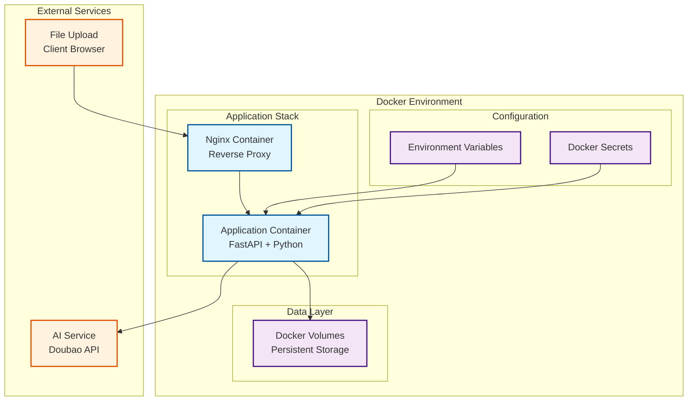
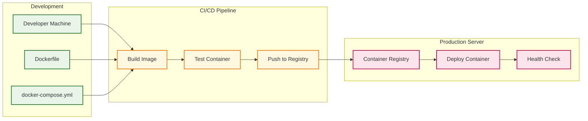

# Design Document

## Overview

本设计文档描述了实验报告自动批阅系统的Docker化部署架构。系统将采用多容器架构，包括主应用容器、数据持久化方案、环境配置管理和部署自动化。设计重点关注可移植性、可扩展性、安全性和易维护性。

## Architecture

### Container Architecture



### Deployment Architecture



## Components and Interfaces

### 1. Application Container

**Purpose**: 运行主要的Python应用程序，包括FastAPI服务器和所有业务逻辑

**Key Features**:
- 基于Python 3.9+的轻量级基础镜像
- 包含所有Python依赖（requirements.txt）
- 支持PDF和Word文档处理库
- 配置非root用户运行
- 健康检查端点

**Interfaces**:
- HTTP API端点（端口8000）
- 文件系统接口（挂载卷）
- 环境变量配置接口
- 日志输出接口

### 2. Nginx Reverse Proxy Container

**Purpose**: 提供反向代理、静态文件服务和负载均衡

**Key Features**:
- 处理静态文件服务（前端资源）
- SSL/TLS终止
- 请求路由和负载均衡
- 文件上传大小限制配置
- 访问日志记录

**Interfaces**:
- 外部HTTP/HTTPS接口（端口80/443）
- 内部应用程序接口
- 配置文件接口
- 日志接口

### 3. Data Persistence Layer

**Purpose**: 管理数据持久化和存储

**Components**:
- `student_reports/`: 学生报告文件存储
- `graded_reports/`: 已评分报告存储
- `output/`: 临时输出文件
- `logs/`: 应用程序日志
- `temp/`: 临时文件处理

**Features**:
- Docker命名卷管理
- 数据备份和恢复支持
- 权限管理
- 存储空间监控

## Data Models

### Environment Configuration Model

```yaml
# 必需的环境变量
required_env:
  - AI_API_KEY: AI服务API密钥
  - ARK_API_KEY: ARK模型API密钥

# 可选的环境变量
optional_env:
  - PORT: 应用程序端口 (默认: 8000)
  - LOG_LEVEL: 日志级别 (默认: INFO)
  - MAX_FILE_SIZE: 最大文件大小 (默认: 100MB)
  - WORKERS: 工作进程数 (默认: 1)
  - AI_TIMEOUT: AI服务超时 (默认: 30s)
```

### Volume Configuration Model

```yaml
volumes:
  student_reports:
    type: named_volume
    mount_point: /app/student_reports
    backup: required
    
  graded_reports:
    type: named_volume
    mount_point: /app/graded_reports
    backup: required
    
  logs:
    type: named_volume
    mount_point: /app/logs
    retention: 30_days
    
  temp:
    type: tmpfs
    mount_point: /app/temp
    size: 1GB
```

## Error Handling

### Container Startup Errors

1. **Missing Environment Variables**
   - 检查必需的环境变量
   - 提供清晰的错误消息
   - 容器启动失败并退出

2. **Port Binding Conflicts**
   - 检测端口占用
   - 提供替代端口建议
   - 记录详细错误信息

3. **Volume Mount Failures**
   - 验证卷挂载权限
   - 检查磁盘空间
   - 提供恢复建议

### Runtime Error Handling

1. **AI Service Connectivity**
   - 实现重试机制
   - 降级处理策略
   - 健康检查集成

2. **File Processing Errors**
   - 文件格式验证
   - 存储空间检查
   - 错误日志记录

3. **Memory and Resource Limits**
   - 容器资源限制
   - 优雅的资源耗尽处理
   - 自动重启策略

## Testing Strategy

### Container Testing

1. **Build Testing**
   - Dockerfile语法验证
   - 依赖安装测试
   - 镜像大小优化验证

2. **Integration Testing**
   - 多容器协作测试
   - 网络连接测试
   - 数据持久化测试

3. **Security Testing**
   - 容器安全扫描
   - 权限验证测试
   - 密钥管理测试

### Deployment Testing

1. **Environment Testing**
   - 不同操作系统兼容性
   - Docker版本兼容性
   - 资源需求验证

2. **Performance Testing**
   - 容器启动时间
   - 资源使用监控
   - 负载测试

3. **Disaster Recovery Testing**
   - 数据备份恢复
   - 容器故障恢复
   - 配置恢复测试

## Security Considerations

### Container Security

1. **Image Security**
   - 使用官方基础镜像
   - 定期更新基础镜像
   - 最小化镜像层数
   - 移除不必要的包

2. **Runtime Security**
   - 非root用户运行
   - 只读文件系统（除必要目录）
   - 资源限制配置
   - 网络隔离

3. **Data Security**
   - 敏感数据加密存储
   - 安全的密钥管理
   - 访问控制和审计
   - 数据传输加密

### Network Security

1. **Internal Communication**
   - 容器间私有网络
   - 最小权限原则
   - 端口访问控制

2. **External Access**
   - HTTPS强制使用
   - 防火墙配置
   - 访问日志记录

## Performance Optimization

### Container Optimization

1. **Image Size Optimization**
   - 多阶段构建
   - 依赖缓存优化
   - 不必要文件清理

2. **Runtime Optimization**
   - 资源限制配置
   - 健康检查优化
   - 启动时间优化

3. **Storage Optimization**
   - 卷类型选择
   - 缓存策略
   - 临时文件清理

### Scaling Strategy

1. **Horizontal Scaling**
   - 负载均衡配置
   - 会话状态管理
   - 数据库连接池

2. **Vertical Scaling**
   - 资源监控
   - 动态资源调整
   - 性能瓶颈识别