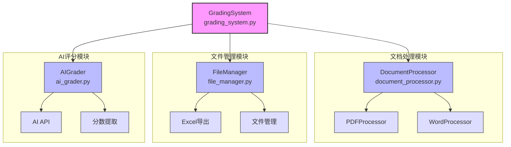
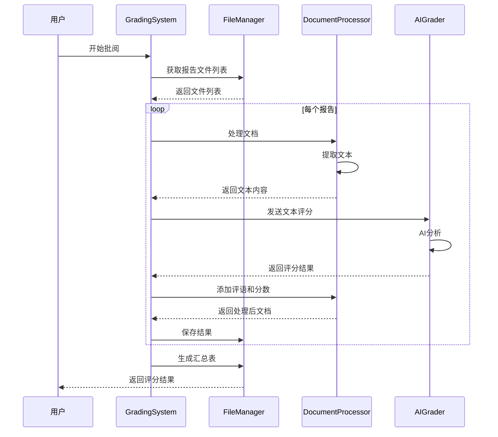

# 实验报告自动批阅系统

## 项目概述
这是一个基于AI的实验报告自动批阅系统，能够自动处理和评分学生提交的实验报告。系统支持PDF和Word格式的报告，可以批量处理报告并生成评分汇总。

## 系统架构

### 模块关系图


### 核心模块说明

1. **GradingSystem (grading_system.py)**
   - 系统的核心控制类
   - 协调各个组件的工作
   - 管理整个批阅流程
   - 处理报告评分和结果汇总

2. **DocumentProcessor (document_processor.py)**
   - 文档处理器的抽象基类和具体实现
   - 支持PDF和Word格式文档
   - 提供文本提取功能
   - 实现评语和分数标注

3. **FileManager (file_manager.py)**
   - 管理文件的存储和组织
   - 提供文件检索功能
   - 支持多种文件格式
   - 处理评分结果导出

4. **AIGrader (ai_grader.py)**
   - 实现AI评分功能
   - 与AI服务器通信
   - 处理评分和评语
   - 提取分数信息

## 数据流程图


## 主要功能

### 文档处理
- 支持多种格式的实验报告：
  - PDF文件（.pdf）
  - Word文档（.doc, .docx）
- 自动提取报告文本内容
- 生成带有评语和分数的标注版PDF

### 智能评分
- 基于AI的智能评分系统
- 五个维度的综合评分：
  1. 实验目的明确性 (20分)
  2. 实验方法合理性 (20分)
  3. 数据分析准确性 (20分)
  4. 结论合理性 (20分)
  5. 报告格式规范性 (20分)
- 自动添加评语和对号标注
- 支持自定义评分标准

[原有的其他内容保持不变...]

## 目录结构
```
├── ai_grader.py          # AI评分模块
├── document_processor.py # 文档处理模块
├── file_manager.py      # 文件管理模块
├── grading_system.py    # 评分系统核心
├── graded_reports/     # 已评分报告存储目录
└── student_reports/    # 学生报告存储目录
```

## 开发说明
- 代码遵循PEP 8规范
- 使用类型注解确保代码可读性
- 包含详细的文档注释
- 模块化设计便于扩展

## 注意事项
- 确保报告文件格式正确（支持PDF和Word格式）
- 评分标准需要清晰定义
- 建议在处理大量报告时使用批量处理功能
- 评分结果保存在graded_reports目录下

## 未来改进计划
1. 添加更多文档格式支持
2. 优化AI评分算法
3. 增加用户界面
4. 添加批注功能
5. 支持自定义评分模板
