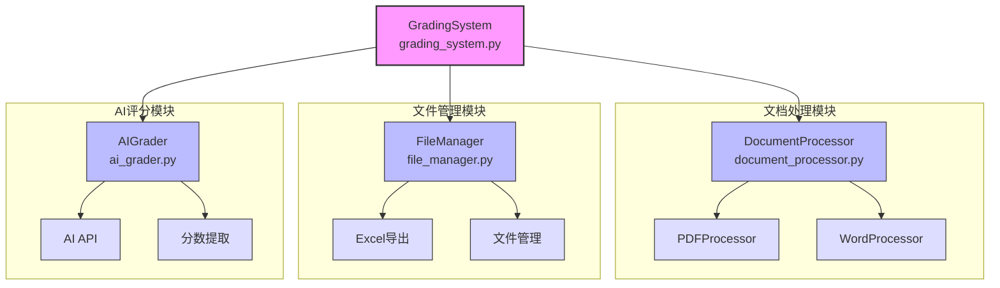
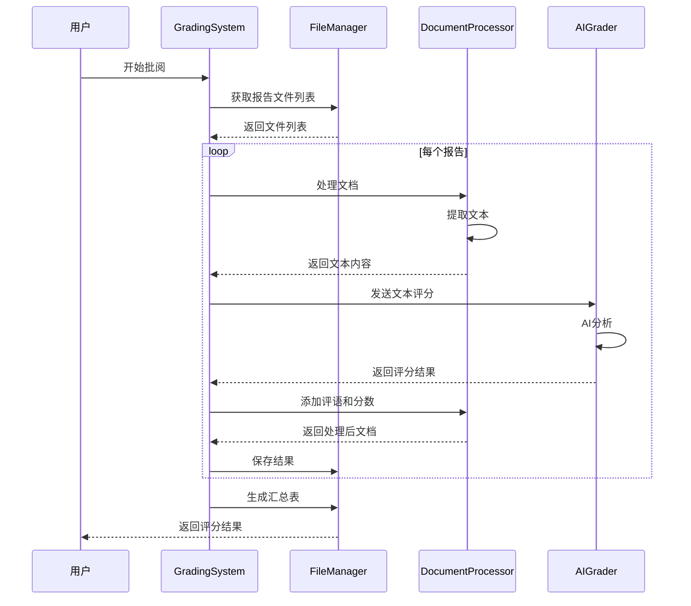

# 实验报告自动批阅系统

## 项目概述
这是一个基于AI的实验报告自动批阅系统，能够自动处理和评分学生提交的实验报告。系统支持PDF和Word格式的报告，可以批量处理报告并生成评分汇总。

### 快速开始（使用 uv）

1. **安装 uv**
   ```bash
   curl -LsSf https://astral.sh/uv/install.sh | sh
   ```

2. **克隆并设置项目**
   ```bash
   git clone <repository-url>
   cd ai_report
   
   # 创建虚拟环境并安装依赖（使用 requirements.txt）
   uv venv
   source .venv/bin/activate
   uv pip install -r requirements.txt
   
   # 或者使用 pyproject.toml（推荐）
   uv venv
   source .venv/bin/activate
   uv sync --dev  # 安装所有依赖，包括开发依赖
   # 或
   uv sync       # 仅安装运行时依赖
   
   # 配置环境变量
   cp .env.example .env
   # 编辑 .env 文件，配置 AI_API_KEY 和 ARK_API_KEY
   ```

3. **启动应用**
   ```bash
   uv run uvicorn main:report --host 0.0.0.0 --port 8000
   ```

4. **使用 uv 管理项目**
   ```bash
   # 同步依赖（当 pyproject.toml 更改时）
   uv sync
   
   # 添加新依赖
   uv add <package-name>
   
   # 添加开发依赖
   uv add --dev <package-name>
   
   # 运行项目
   uv run python -c "from api_server import app; import uvicorn; import os; port = int(os.getenv('PORT', 8000)); uvicorn.run(app, host='0.0.0.0', port=port)"
   ```

## 系统架构

### 模块关系图


### 核心模块说明

1. **GradingSystem (grading_system.py)**
   - 系统的核心控制类
   - 协调各个组件的工作
   - 管理整个批阅流程
   - 处理报告评分和结果汇总

2. **DocumentProcessor (document_processor.py)**
   - 文档处理器的抽象基类和具体实现
   - 支持PDF和Word格式文档
   - 提供文本提取功能
   - 实现评语和分数标注

3. **FileManager (file_manager.py)**
   - 管理文件的存储和组织
   - 提供文件检索功能
   - 支持多种文件格式
   - 处理评分结果导出

4. **AIGrader (ai_grader.py)**
   - 实现AI评分功能
   - 与AI服务器通信
   - 处理评分和评语
   - 提取分数信息

## 数据流程图


## 主要功能

### 文档处理
- 支持多种格式的实验报告：
  - PDF文件（.pdf）
  - Word文档（.doc, .docx）
- 自动提取报告文本内容
- 生成带有评语和分数的标注版PDF

### 智能评分
- 基于AI的智能评分系统
- 五个维度的综合评分：
  1. 实验目的明确性 (20分)
  2. 实验方法合理性 (20分)
  3. 数据分析准确性 (20分)
  4. 结论合理性 (20分)
  5. 报告格式规范性 (20分)
- 自动添加评语和对号标注
- 支持自定义评分标准

[原有的其他内容保持不变...]

## 目录结构
```
├── ai_grader.py          # AI评分模块
├── document_processor.py # 文档处理模块
├── file_manager.py      # 文件管理模块
├── grading_system.py    # 评分系统核心
├── graded_reports/     # 已评分报告存储目录
└── student_reports/    # 学生报告存储目录
```

## 开发说明
- 代码遵循PEP 8规范
- 使用类型注解确保代码可读性
- 包含详细的文档注释
- 模块化设计便于扩展

## 环境设置

### 使用 uv 管理依赖（推荐）

1. **安装 uv**
   ```bash
   # 从官方网站安装
   curl -LsSf https://astral.sh/uv/install.sh | sh
   
   # 或使用 pip 安装
   pip install uv
   ```

2. **创建虚拟环境并安装依赖**
   ```bash
   # 创建并激活虚拟环境，安装依赖
   uv venv
   source .venv/bin/activate  # Linux/Mac
   # 或
   .venv\Scripts\activate   # Windows
   
   # 安装项目依赖
   uv pip install -r requirements.txt
   ```

3. **配置环境变量**
   ```bash
   cp .env.example .env
   # 编辑 .env 文件，配置 AI_API_KEY 和 ARK_API_KEY
   ```

### 使用传统 pip 方式

1. **创建虚拟环境**
   ```bash
   python -m venv .venv
   source .venv/bin/activate  # Linux/Mac
   # 或
   .venv\Scripts\activate   # Windows
   pip install -r requirements.txt
   ```

## 注意事项
- 确保报告文件格式正确（支持PDF和Word格式）
- 评分标准需要清晰定义
- 建议在处理大量报告时使用批量处理功能
- 评分结果保存在graded_reports目录下

## Docker 部署

### 快速开始

1. **克隆项目并进入目录**
```bash
git clone <repository-url>
cd grading-system
```

2. **配置环境变量**
```bash
cp .env.example .env
# 编辑 .env 文件，配置 AI_API_KEY 和 ARK_API_KEY
```

3. **一键部署**
```bash
# 基本部署
./scripts/quick-start.sh

# 启用 SSL 和监控
./scripts/quick-start.sh --ssl --monitoring
```

4. **访问应用**
- Web 界面: http://localhost
- 健康检查: http://localhost/health

### 详细部署指南

请参阅 [DEPLOYMENT.md](DEPLOYMENT.md) 获取完整的部署文档，包括：
- 系统要求和环境准备
- 详细配置说明
- SSL/HTTPS 配置
- 数据备份和恢复
- 监控和日志管理
- 故障排除指南

### 常用命令

```bash
# 查看服务状态
docker-compose ps

# 查看日志
docker-compose logs -f

# 健康检查
./scripts/health-check.sh all

# 备份数据
./scripts/backup.sh

# 更新系统
./scripts/update.sh

# 停止服务
docker-compose down
### 自动设置脚本

项目提供了一个自动设置脚本，使用 uv 管理依赖：

```bash
# 给脚本添加执行权限
chmod +x scripts/setup_with_uv.sh

# 运行设置脚本
./scripts/setup_with_uv.sh
```

### 启动命令

1. **开发模式启动（使用 uv）**
   ```bash
   # 确保虚拟环境已激活且依赖已安装
   uv run uvicorn main:report --host 0.0.0.0 --port 8000
   # 或
   uv run uvicorn api_server:app --host 0.0.0.0 --port 8000 --reload
   ```

2. **开发模式启动（使用传统 pip）**
   ```bash
   # 激活虚拟环境后
   uvicorn main:report --host 0.0.0.0 --port 8000
   # 或
   uvicorn api_server:app --host 0.0.0.0 --port 8000 --reload
   ```

3. **生产模式启动（Docker）**
   ```bash
   docker-compose up --build
   ```

4. **直接运行Python脚本**
   ```bash
   python -c "from api_server import app; import uvicorn; import os; port = int(os.getenv('PORT', 8000)); uvicorn.run(app, host='0.0.0.0', port=port)"
   ```

## 技术架构

### 后端技术栈

#### Web框架
- **FastAPI**：高性能Web框架，支持异步处理
- **Uvicorn**：ASGI服务器，用于运行FastAPI应用
- **Pydantic**：数据验证和序列化库

#### AI/ML组件
- **豆包大模型（Doubao）**：用于报告评分的AI服务
- **volcenginesdkarkruntime**：豆包模型的SDK
- **正则表达式**：用于从AI返回文本中提取分数

#### 文档处理
- **PyPDF2**：PDF文档处理
- **pdfplumber**：PDF文本提取
- **reportlab**：PDF生成和标注
- **python-docx**：Word文档处理
- **win32com.client**：支持旧版Word文档（.doc）

#### 数据处理
- **pandas**：用于Excel文件处理
- **csv**：CSV文件处理

#### 配置管理
- **python-dotenv**：环境变量管理
- **os**：系统路径和环境操作

### 前端技术栈

#### 前端技术
- **HTML5**：页面结构
- **CSS3**：样式设计
- **JavaScript**：前端交互逻辑
- **Fetch API**：与后端API通信

#### 前端架构
- **原生JavaScript**：无额外框架，使用原生JS实现功能
- **AJAX**：异步数据加载和交互
- **响应式设计**：支持不同屏幕尺寸

### 部署技术栈

#### 容器化
- **Docker**：容器化部署
- **Docker Compose**：多容器应用编排

#### Web服务器
- **Nginx**：反向代理和静态文件服务
- **SSL/TLS**：HTTPS支持

#### 监控系统
- **Prometheus**：指标收集和监控
- **Grafana**：监控面板
- **Loki**：日志聚合
- **Promtail**：日志收集
- **Alertmanager**：告警管理

### 系统特性

#### 架构模式
- **模块化设计**：各组件职责清晰，易于维护和扩展
- **API优先**：以API为中心的架构设计
- **前后端分离**：前端和后端完全分离

#### 性能优化
- **异步处理**：使用异步I/O和线程池优化AI调用
- **缓存策略**：Nginx配置静态资源缓存
- **临时文件管理**：使用内存挂载临时目录

#### 可扩展性
- **插件式架构**：文档处理器支持多种格式
- **配置驱动**：通过配置文件调整系统行为
- **微服务准备**：模块化设计便于未来微服务化

### 开发规范

#### 代码质量
- **类型注解**：使用Python类型提示
- **日志记录**：完整的日志记录系统
- **异常处理**：全面的错误处理机制
- **文档注释**：详细的代码注释和文档

## 部署配置

### Docker配置

#### Dockerfile
- **基础镜像**：使用 `python:3.12-slim`
- **系统优化**：配置国内Debian源（清华源）以提高构建速度
- **依赖安装**：
  - 编译工具：`gcc`, `g++`
  - 加密库：`libssl-dev`, `libffi-dev`, `cargo`
  - PDF处理：`poppler-utils`
- **Python依赖**：使用国内pip源安装requirements
- **安全措施**：创建非root用户运行应用
- **端口暴露**：暴露端口7654
- **启动命令**：使用uvicorn运行FastAPI应用

#### Docker Compose
- **服务名称**：`ai_report_app`
- **端口映射**：将容器端口7654映射到主机端口7654
- **数据卷**：
  - `ai_report_student_reports`：学生报告存储
  - `ai_report_graded_reports`：已评分报告存储
  - `ai_report_output_data`：输出数据存储
  - `ai_report_app_logs`：应用日志存储
  - `ai_report_nginx_logs`：Nginx日志存储
- **临时文件**：使用tmpfs挂载临时目录，容器停止后自动清空
- **网络**：使用自定义网络 `grading-network`

### Nginx配置

#### 主配置
- **安全头**：设置X-Frame-Options、X-Content-Type-Options等安全头
- **限流**：API请求限流和上传限流
- **包含配置**：包含其他配置文件

#### 默认配置
- **反向代理**：将API请求代理到后端应用服务器
- **上传处理**：特殊处理文件上传，增加超时和缓冲设置
- **健康检查**：提供健康检查端点
- **安全规则**：禁止访问隐藏文件和备份文件
- **错误页面**：自定义错误页面

### 环境配置

#### 配置文件 (config.py)
- **环境变量**：从.env文件加载配置
- **路径配置**：定义基础目录、报告目录、输出目录等
- **API配置**：AI服务API密钥和端点配置
- **安全配置**：定义允许的主机和安全设置
- **日志配置**：设置日志级别和格式

## 项目管理工具

### uv (推荐)

uv 是一个快速的 Python 包管理器，提供以下优势：

- **快速安装**：比传统 pip 安装速度快很多
- **依赖解析**：更快的依赖解析算法
- **虚拟环境管理**：内置虚拟环境管理功能
- **现代工作流**：与现代 Python 开发生态系统集成

#### 使用 uv 的优势

1. **性能**：uv 使用 Rust 编写，安装依赖比 pip 快很多
2. **一致性**：确保所有开发者使用相同的依赖版本
3. **简化命令**：使用更简单的命令管理项目
4. **锁定文件**：自动生成 uv.lock 文件确保可重现的构建

## 未来改进计划
1. 添加更多文档格式支持
2. 优化AI评分算法
3. 增加用户界面
4. 添加批注功能
5. 支持自定义评分模板
6. Kubernetes 部署支持
7. 微服务架构重构
