# AI 实验报告自动批阅系统 - 完整技术文档

## 目录
1. [系统概述](#系统概述)
2. [数据库设计](#数据库设计)
3. [后端架构](#后端架构)
4. [前端架构](#前端架构)
5. [API接口文档](#api接口文档)
6. [系统模块图](#系统模块图)
7. [业务流程泳道图](#业务流程泳道图)
8. [部署架构](#部署架构)

---

## 系统概述

### 系统简介
AI 实验报告自动批阅系统是一个基于人工智能的实验报告自动化评分平台，支持批量处理 PDF 和 Word 格式的实验报告，提供智能评分、评语生成、用户管理、数据统计等功能。

### 核心功能
- **智能批阅**：基于 AI 模型的自动评分和评语生成
- **多格式支持**：支持 PDF、Word（.doc/.docx）格式
- **用户管理**：多用户系统，支持管理员和普通用户
- **配置管理**：用户可自定义评分标准和分数范围
- **数据统计**：提供详细的使用数据统计和可视化
- **批量处理**：支持批量上传和批阅报告

### 技术栈
- **后端**：Python + FastAPI + PostgreSQL
- **前端**：HTML5 + CSS3 + JavaScript（原生）
- **AI服务**：豆包大模型（Doubao）
- **部署**：Docker + Docker Compose + Nginx

---

## 数据库设计

### 数据库表结构

#### 1. users（用户表）
存储系统用户信息，包括管理员和普通用户。

| 字段名 | 类型 | 约束 | 说明 |
|--------|------|------|------|
| id | SERIAL | PRIMARY KEY | 用户ID，自增主键 |
| username | VARCHAR(50) | UNIQUE NOT NULL | 用户名，唯一 |
| password | VARCHAR(255) | NOT NULL | 密码（bcrypt加密） |
| email | VARCHAR(100) | UNIQUE | 邮箱地址 |
| role | VARCHAR(20) | DEFAULT 'user' | 角色：user/admin/super_admin |
| created_at | TIMESTAMP | DEFAULT CURRENT_TIMESTAMP | 创建时间 |
| updated_at | TIMESTAMP | DEFAULT CURRENT_TIMESTAMP | 更新时间 |
| is_active | BOOLEAN | DEFAULT TRUE | 是否激活 |
| last_login | TIMESTAMP | NULL | 最后登录时间 |

**索引**：
- PRIMARY KEY: id
- UNIQUE: username
- UNIQUE: email

**触发器**：
- `update_users_updated_at`: 更新时自动更新 updated_at 字段

**默认数据**：
```sql
INSERT INTO users (username, password, email, role) 
VALUES ('admin', '$2b$12$LQv3c1yqBWVHxkd0LHAkCOYz6TtxMQJqhN8/LewY5GyYzW5W5W5W5', 'admin@example.com', 'super_admin')
```

---

#### 2. logs（日志表）
记录系统操作日志，用于审计和监控。

| 字段名 | 类型 | 约束 | 说明 |
|--------|------|------|------|
| id | SERIAL | PRIMARY KEY | 日志ID，自增主键 |
| user_id | INTEGER | REFERENCES users(id) ON DELETE SET NULL | 用户ID |
| action | VARCHAR(100) | NOT NULL | 操作类型 |
| details | TEXT | NULL | 操作详情 |
| ip_address | VARCHAR(45) | NULL | IP地址 |
| user_agent | TEXT | NULL | 用户代理 |
| created_at | TIMESTAMP | DEFAULT CURRENT_TIMESTAMP | 创建时间 |

**索引**：
- PRIMARY KEY: id
- INDEX: user_id (idx_logs_user_id)
- INDEX: created_at (idx_logs_created_at)

**外键约束**：
- user_id → users(id) ON DELETE SET NULL

---

#### 3. grading_records（批阅记录表）
记录报告批阅的历史记录。

| 字段名 | 类型 | 约束 | 说明 |
|--------|------|------|------|
| id | SERIAL | PRIMARY KEY | 记录ID，自增主键 |
| user_id | INTEGER | REFERENCES users(id) ON DELETE SET NULL | 用户ID |
| directory_name | VARCHAR(255) | NOT NULL | 目录名称 |
| file_count | INTEGER | DEFAULT 0 | 文件数量 |
| qualified_count | INTEGER | DEFAULT 0 | 合格数量 |
| unqualified_count | INTEGER | DEFAULT 0 | 不合格数量 |
| min_score | FLOAT | NULL | 最低分数 |
| max_score | FLOAT | NULL | 最高分数 |
| model_used | VARCHAR(100) | NULL | 使用的AI模型 |
| created_at | TIMESTAMP | DEFAULT CURRENT_TIMESTAMP | 创建时间 |

**索引**：
- PRIMARY KEY: id
- INDEX: user_id (idx_grading_records_user_id)
- INDEX: created_at (idx_grading_records_created_at)

**外键约束**：
- user_id → users(id) ON DELETE SET NULL

---

#### 4. user_configs（用户配置表）
存储用户的个性化配置，包括评分标准和分数范围。

| 字段名 | 类型 | 约束 | 说明 |
|--------|------|------|------|
| id | SERIAL | PRIMARY KEY | 配置ID，自增主键 |
| user_id | INTEGER | UNIQUE REFERENCES users(id) ON DELETE CASCADE | 用户ID |
| criteria | TEXT | NOT NULL | 评分标准 |
| min_score | INTEGER | DEFAULT 60 | 最低分数 |
| max_score | INTEGER | DEFAULT 95 | 最高分数 |
| created_at | TIMESTAMP | DEFAULT CURRENT_TIMESTAMP | 创建时间 |
| updated_at | TIMESTAMP | DEFAULT CURRENT_TIMESTAMP | 更新时间 |

**索引**：
- PRIMARY KEY: id
- UNIQUE: user_id (idx_user_configs_user_id)

**外键约束**：
- user_id → users(id) ON DELETE CASCADE

---

### ER图

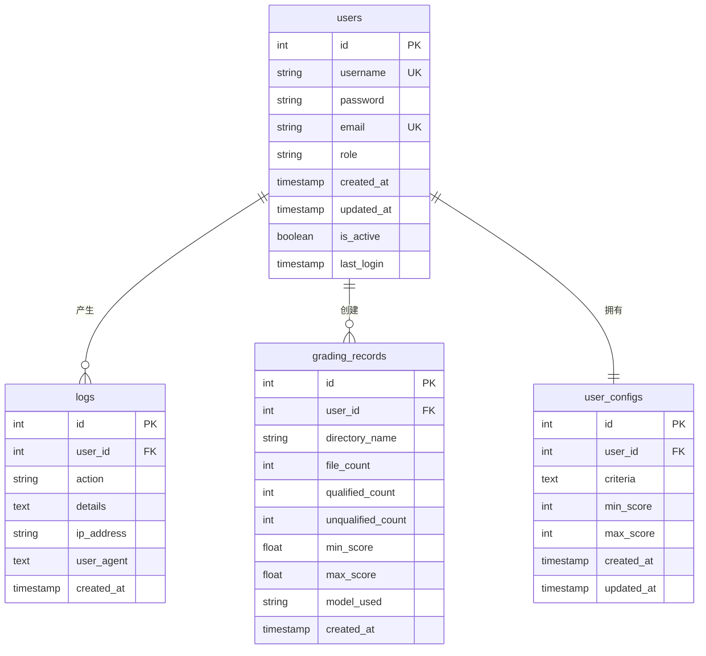

---

## 后端架构

### 核心模块

#### 1. api_server.py（API服务器）
FastAPI 应用主文件，提供所有 RESTful API 接口。

**主要功能**：
- 用户认证和授权（JWT）
- 用户管理（CRUD）
- 报告上传和批阅
- 配置管理
- 日志记录
- 统计数据

**关键类和函数**：
- `get_current_user()`: 获取当前登录用户
- `get_current_active_user()`: 获取当前激活用户
- `require_admin()`: 管理员权限验证
- `login()`: 用户登录
- `register()`: 用户注册

---

#### 2. user_manager.py（用户管理器）
管理用户相关的所有操作。

**主要方法**：
- `create_user()`: 创建新用户
- `authenticate_user()`: 用户认证
- `get_user_by_id()`: 根据ID获取用户
- `get_user_by_username()`: 根据用户名获取用户
- `get_all_users()`: 获取所有用户
- `update_user_role()`: 更新用户角色
- `activate_user()`: 激活用户
- `deactivate_user()`: 停用用户
- `delete_user()`: 删除用户
- `is_admin()`: 检查是否为管理员
- `is_super_admin()`: 检查是否为超级管理员

---

#### 3. config_manager.py（配置管理器）
管理用户配置和评分标准。

**主要方法**：
- `get_user_config()`: 获取用户配置
- `create_user_config()`: 创建用户配置
- `update_user_config()`: 更新用户配置
- `delete_user_config()`: 删除用户配置
- `get_default_config()`: 获取默认配置

---

#### 4. log_manager.py（日志管理器）
管理系统操作日志。

**主要方法**：
- `log_action()`: 记录操作日志
- `log_user_login()`: 记录用户登录
- `get_logs()`: 获取日志列表
- `get_user_logs()`: 获取用户日志
- `get_logs_by_action()`: 根据操作类型获取日志

---

#### 5. grading_system.py（批阅系统）
核心批阅逻辑，协调文档处理和AI评分。

**主要类**：
- `GradingSystem`: 批阅系统主类

**主要方法**：
- `grade_reports()`: 批量批阅报告
- `grade_single_report()`: 批阅单个报告
- `extract_scores()`: 提取评分结果

---

#### 6. document_processor.py（文档处理器）
处理各种格式的文档。

**主要类**：
- `DocumentProcessor`: 文档处理器基类
- `PDFProcessor`: PDF文档处理器
- `WordProcessor`: Word文档处理器

**主要方法**：
- `extract_text()`: 提取文档文本
- `add_annotations()`: 添加批注
- `save_annotated()`: 保存批注版文档

---

#### 7. ai_grader.py（AI评分器）
与AI服务交互，获取评分和评语。

**主要方法**：
- `grade_report()`: 评分报告
- `extract_score()`: 提取分数
- `generate_feedback()`: 生成评语

---

#### 8. file_manager.py（文件管理器）
管理文件存储和检索。

**主要方法**：
- `save_file()`: 保存文件
- `get_file()`: 获取文件
- `delete_file()`: 删除文件
- `list_files()`: 列出文件
- `export_to_excel()`: 导出到Excel

---

### 后端架构图

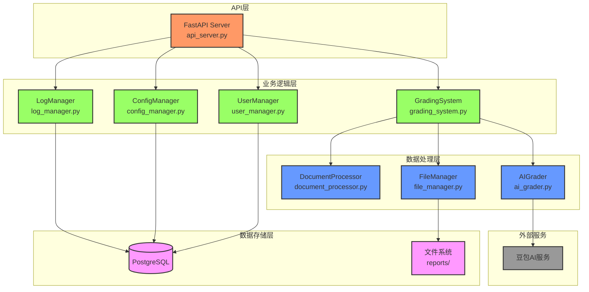

---

## 前端架构

### 前端文件结构

```
front/
├── index.html              # 主页面
├── login.html              # 登录页面
├── admin_dashboard.html    # 管理员仪表板
├── admin_users.html        # 用户管理页面
├── admin_logs.html         # 日志查看页面
├── style.css               # 主样式
├── login.css               # 登录页面样式
├── admin.css               # 管理后台样式
├── script.js               # 主页面脚本
├── login.js               # 登录页面脚本
├── admin_dashboard.js      # 管理员仪表板脚本
├── admin_users.js          # 用户管理脚本
└── admin_logs.js           # 日志查看脚本
```

---

### 前端页面说明

#### 1. index.html（主页面）
用户批阅报告的主界面。

**功能模块**：
- 左侧：批阅要求配置
- 中间：已批阅报告列表
- 右侧：批阅操作和结果

**主要功能**：
- 配置评分标准
- 上传报告
- 查看批阅结果
- 下载批注版报告

---

#### 2. login.html（登录页面）
用户登录界面。

**主要功能**：
- 用户名/密码登录
- 表单验证
- 错误提示
- 记住登录状态

---

#### 3. admin_dashboard.html（管理员仪表板）
管理员数据统计和可视化界面。

**主要功能**：
- 系统概览统计
- 用户活跃度图表
- 操作分布图表
- 用户工作量图表
- 每日汇总图表
- 最近活动列表

---

#### 4. admin_users.html（用户管理页面）
管理员管理用户界面。

**主要功能**：
- 用户列表展示
- 创建新用户
- 编辑用户信息
- 删除用户
- 激活/停用用户
- 查看用户详情

---

#### 5. admin_logs.html（日志查看页面）
管理员查看系统日志界面。

**主要功能**：
- 日志列表展示
- 按用户筛选
- 按操作类型筛选
- 按时间范围筛选
- 日志详情查看

---

### 前端架构图

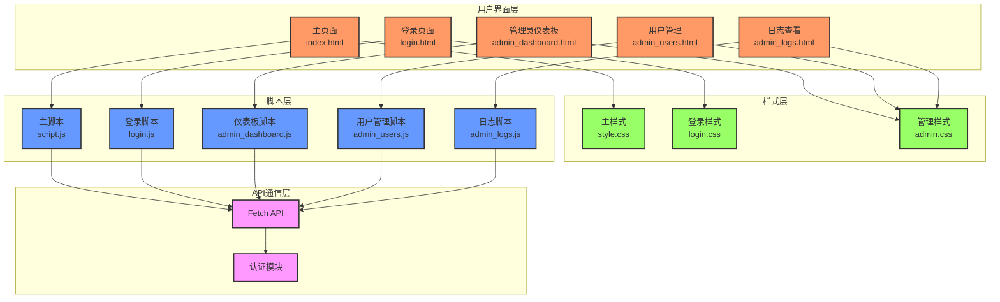

---

## API接口文档

### 认证相关接口

#### 1. 用户注册
- **URL**: `/api/auth/register`
- **方法**: `POST`
- **请求体**:
```json
{
  "username": "testuser",
  "password": "password123",
  "email": "test@example.com"
}
```
- **响应**:
```json
{
  "id": 1,
  "username": "testuser",
  "email": "test@example.com",
  "role": "user",
  "is_active": true,
  "created_at": "2024-01-01T00:00:00Z"
}
```

---

#### 2. 用户登录
- **URL**: `/api/auth/login`
- **方法**: `POST`
- **请求体** (form-data):
```
username: testuser
password: password123
```
- **响应**:
```json
{
  "access_token": "eyJhbGciOiJIUzI1NiIsInR5cCI6IkpXVCJ9...",
  "token_type": "bearer",
  "user": {
    "id": 1,
    "username": "testuser",
    "email": "test@example.com",
    "role": "user"
  }
}
```

---

#### 3. 获取当前用户信息
- **URL**: `/api/auth/me`
- **方法**: `GET`
- **请求头**:
```
Authorization: Bearer <token>
```
- **响应**:
```json
{
  "id": 1,
  "username": "testuser",
  "email": "test@example.com",
  "role": "user",
  "is_active": true,
  "created_at": "2024-01-01T00:00:00Z"
}
```

---

### 用户管理接口（管理员）

#### 4. 获取所有用户
- **URL**: `/api/admin/users`
- **方法**: `GET`
- **请求头**:
```
Authorization: Bearer <token>
```
- **响应**:
```json
[
  {
    "id": 1,
    "username": "admin",
    "email": "admin@example.com",
    "role": "super_admin",
    "is_active": true,
    "created_at": "2024-01-01T00:00:00Z",
    "last_login": "2024-01-05T15:32:48Z"
  }
]
```

---

#### 5. 创建用户
- **URL**: `/api/admin/users`
- **方法**: `POST`
- **请求头**:
```
Authorization: Bearer <token>
```
- **请求体**:
```json
{
  "username": "newuser",
  "password": "password123",
  "email": "newuser@example.com",
  "role": "user"
}
```
- **响应**:
```json
{
  "id": 2,
  "username": "newuser",
  "email": "newuser@example.com",
  "role": "user",
  "is_active": true,
  "created_at": "2024-01-05T00:00:00Z"
}
```

---

#### 6. 更新用户
- **URL**: `/api/admin/users/{user_id}`
- **方法**: `PUT`
- **请求头**:
```
Authorization: Bearer <token>
```
- **请求体**:
```json
{
  "email": "updated@example.com",
  "role": "admin"
}
```
- **响应**:
```json
{
  "id": 2,
  "username": "newuser",
  "email": "updated@example.com",
  "role": "admin",
  "is_active": true,
  "created_at": "2024-01-05T00:00:00Z"
}
```

---

#### 7. 删除用户
- **URL**: `/api/admin/users/{user_id}`
- **方法**: `DELETE`
- **请求头**:
```
Authorization: Bearer <token>
```
- **响应**:
```json
{
  "message": "用户删除成功"
}
```

---

### 报告批阅接口

#### 8. 上传报告
- **URL**: `/api/upload`
- **方法**: `POST`
- **请求头**:
```
Authorization: Bearer <token>
```
- **请求体** (form-data):
```
file: <binary file>
```
- **响应**:
```json
{
  "message": "文件上传成功",
  "filename": "张三_物理实验报告.pdf"
}
```

---

#### 9. 批阅报告
- **URL**: `/api/annotate`
- **方法**: `POST`
- **请求头**:
```
Authorization: Bearer <token>
```
- **请求体**:
```json
{
  "directory": "内蒙古民族大学-电子-22级-6班-嵌入图形界面开发-嵌入式图形界面开发实验一"
}
```
- **响应**:
```json
{
  "message": "成功扫描了 5 个文档",
  "documents": [
    {
      "filename": "张三_物理实验报告.pdf",
      "type": "PDF",
      "content": "文档内容预览...",
      "status": "合格",
      "score": 85,
      "size": 12345
    }
  ],
  "failed_count": 1,
  "csv_file": "output/不合格报告_20240105_123045.csv"
}
```

---

#### 10. 获取报告列表
- **URL**: `/api/reports/`
- **方法**: `GET`
- **查询参数**:
- `directory`: 可选，目录名称
- **请求头**:
```
Authorization: Bearer <token>
```
- **响应**:
```json
[
  {
    "filename": "张三_物理实验报告.pdf",
    "path": "/path/to/reports/...",
    "status": "已批阅"
  }
]
```

---

#### 11. 下载批注版报告
- **URL**: `/api/download-graded`
- **方法**: `GET`
- **查询参数**:
- `filename`: 文件名
- **请求头**:
```
Authorization: Bearer <token>
```
- **响应**: 文件流

---

### 配置管理接口

#### 12. 获取用户配置
- **URL**: `/api/criteria`
- **方法**: `GET`
- **请求头**:
```
Authorization: Bearer <token>
```
- **响应**:
```json
{
  "criteria": "评分标准内容...",
  "min_score": 60,
  "max_score": 95
}
```

---

#### 13. 更新用户配置
- **URL**: `/api/criteria`
- **方法**: `POST`
- **请求头**:
```
Authorization: Bearer <token>
```
- **请求体**:
```json
{
  "criteria": "新的评分标准...",
  "min_score": 60,
  "max_score": 95
}
```
- **响应**:
```json
{
  "message": "评分标准已更新"
}
```

---

#### 14. 重置用户配置
- **URL**: `/api/criteria/reset`
- **方法**: `POST`
- **请求头**:
```
Authorization: Bearer <token>
```
- **响应**:
```json
{
  "message": "评分标准已重置为默认值",
  "criteria": "默认评分标准...",
  "min_score": 60,
  "max_score": 95
}
```

---

### 统计数据接口（管理员）

#### 15. 获取系统概览
- **URL**: `/api/admin/stats/overview`
- **方法**: `GET`
- **请求头**:
```
Authorization: Bearer <token>
```
- **响应**:
```json
{
  "total_users": 10,
  "active_users": 8,
  "total_reports": 100,
  "total_gradings": 95,
  "today_users": 5,
  "today_gradings": 10
}
```

---

#### 16. 获取用户活跃度
- **URL**: `/api/admin/stats/user-activity`
- **方法**: `GET`
- **请求头**:
```
Authorization: Bearer <token>
```
- **响应**:
```json
{
  "dates": ["2024-01-01", "2024-01-02"],
  "active_users": [5, 8]
}
```

---

#### 17. 获取操作分布
- **URL**: `/api/admin/stats/action-distribution`
- **方法**: `GET`
- **请求头**:
```
Authorization: Bearer <token>
```
- **响应**:
```json
{
  "actions": ["login", "upload", "grade", "download"],
  "counts": [50, 30, 20, 15]
}
```

---

#### 18. 获取用户工作量
- **URL**: `/api/admin/stats/user-work`
- **方法**: `GET`
- **请求头**:
```
Authorization: Bearer <token>
```
- **响应**:
```json
{
  "users": ["user1", "user2", "user3"],
  "upload_counts": [10, 15, 8],
  "grade_counts": [8, 12, 6]
}
```

---

### 日志接口（管理员）

#### 19. 获取所有日志
- **URL**: `/api/admin/logs`
- **方法**: `GET`
- **查询参数**:
- `user_id`: 可选，用户ID
- `action`: 可选，操作类型
- `limit`: 可选，返回数量
- **请求头**:
```
Authorization: Bearer <token>
```
- **响应**:
```json
{
  "logs": [
    {
      "id": 1,
      "user_id": 1,
      "username": "admin",
      "action": "login",
      "details": "用户登录",
      "ip_address": "192.168.1.1",
      "created_at": "2024-01-05T15:32:48Z"
    }
  ],
  "total": 100
}
```

---

### 健康检查接口

#### 20. 健康检查
- **URL**: `/health` 或 `/api/health`
- **方法**: `GET`
- **响应**:
```json
{
  "status": "healthy",
  "timestamp": "2024-01-05T15:32:48Z"
}
```

---

## 系统模块图

### 整体架构模块图

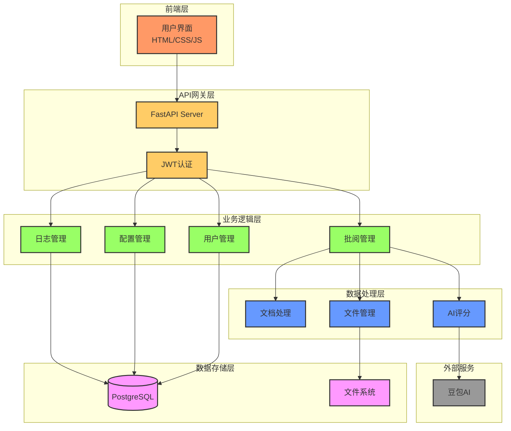

---

### 批阅流程模块图

```mermaid
graph TB
    Start[开始批阅] --> Upload[上传报告]
    Upload --> Extract[提取文本]
    Extract --> AI[AI评分]
    AI --> Score[提取分数]
    Score --> Annotate[添加批注]
    Annotate --> Save[保存结果]
    Save --> Export[导出汇总]
    Export --> End[完成]
    
    classDef start fill:#f96,stroke:#333,stroke-width:2px
    classDef process fill:#9f6,stroke:#333,stroke-width:2px
    classDef end fill:#69f,stroke:#333,stroke-width:2px
    
    class Start,End start
    class Upload,Extract,AI,Score,Annotate,Save,Export process
```

---

## 业务流程泳道图

### 用户登录流程

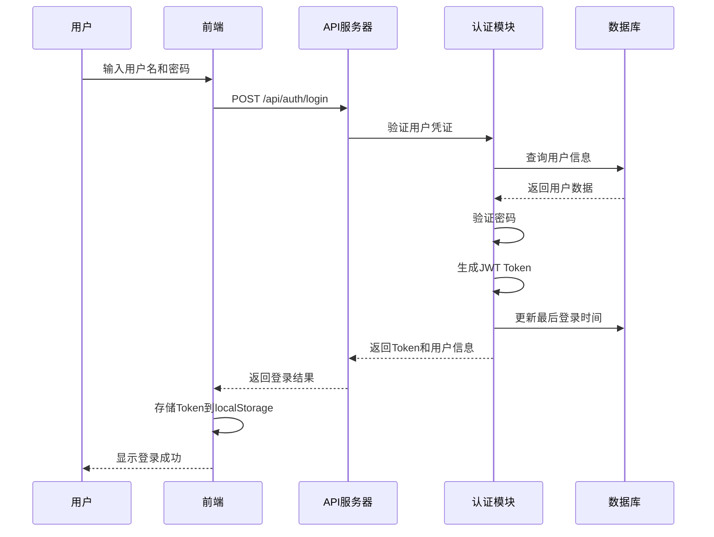

---

### 报告批阅流程

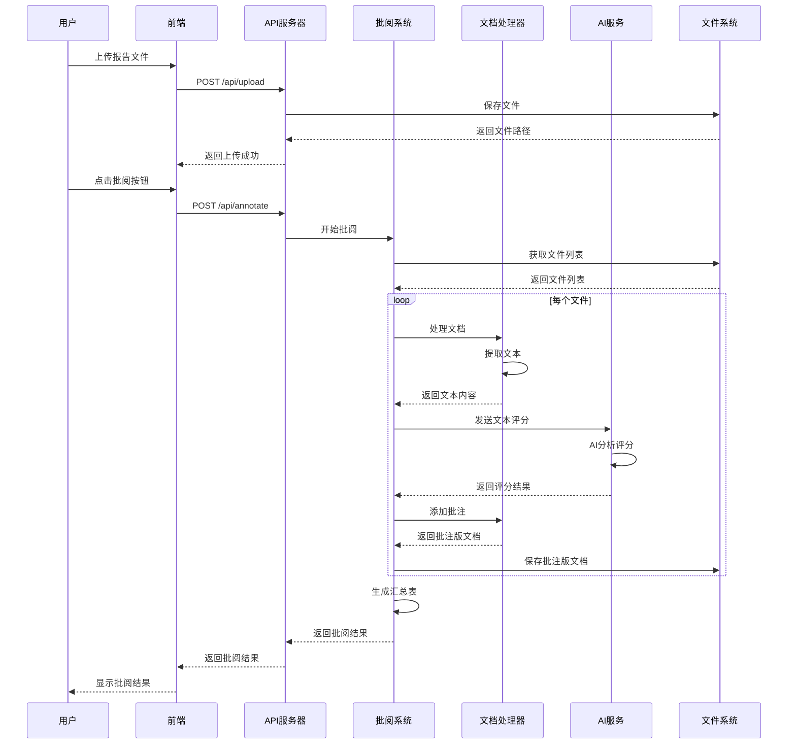

---

### 用户管理流程（管理员）

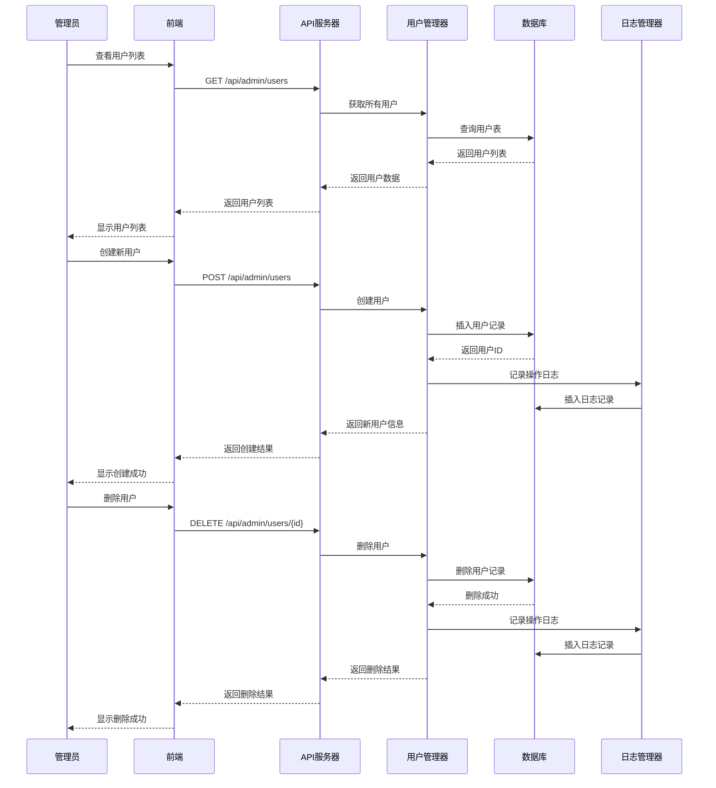

---

### 配置管理流程

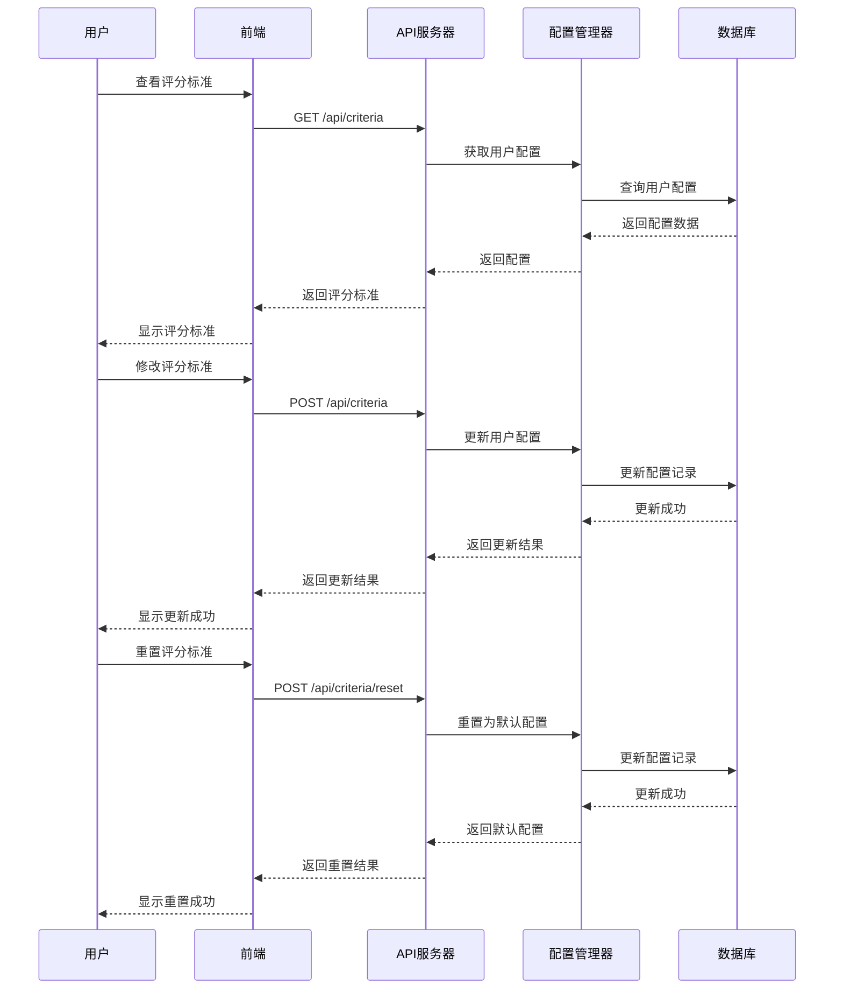

---

### 统计数据查询流程

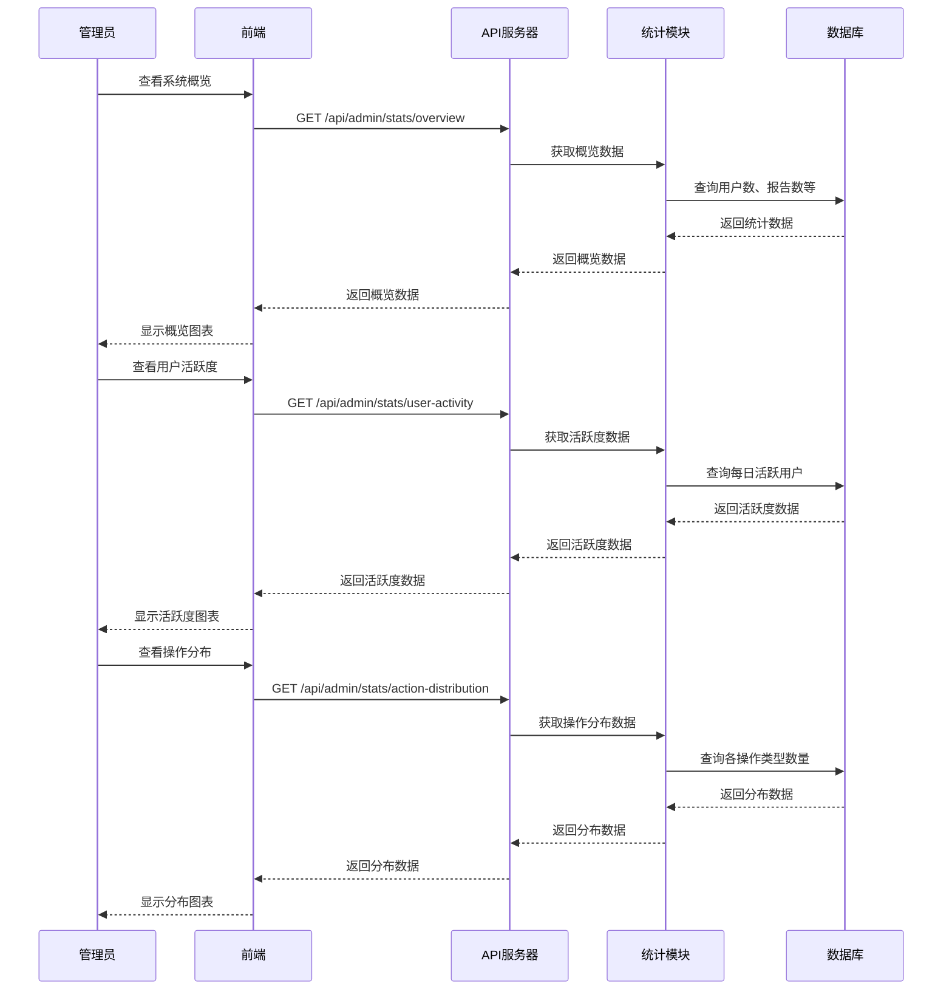

---

## 部署架构

### Docker部署架构

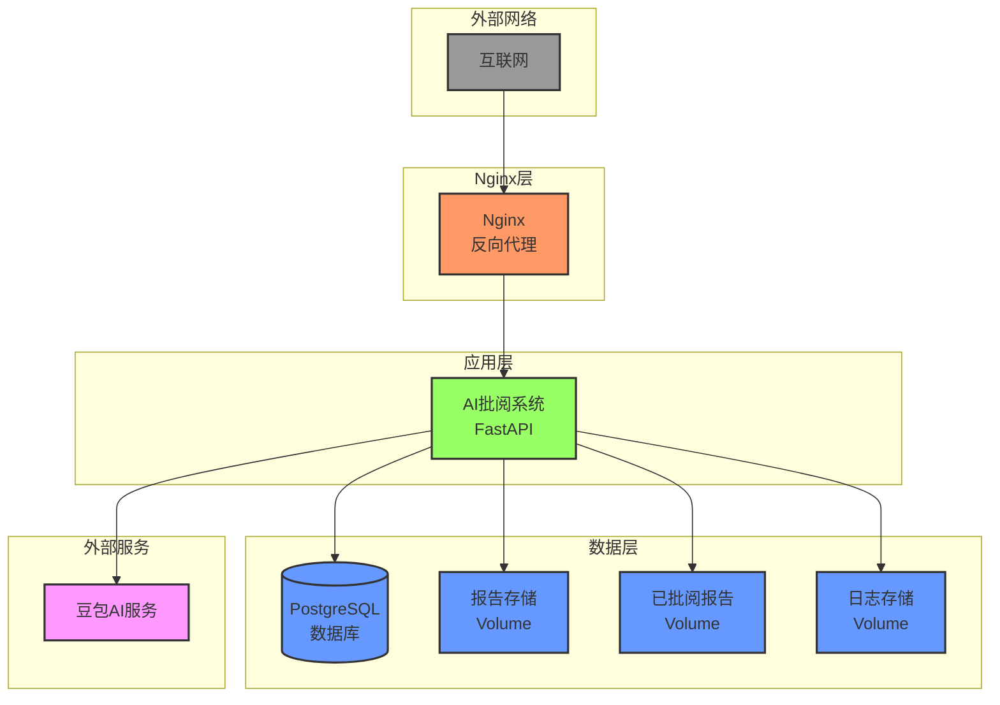

---

### 网络架构图

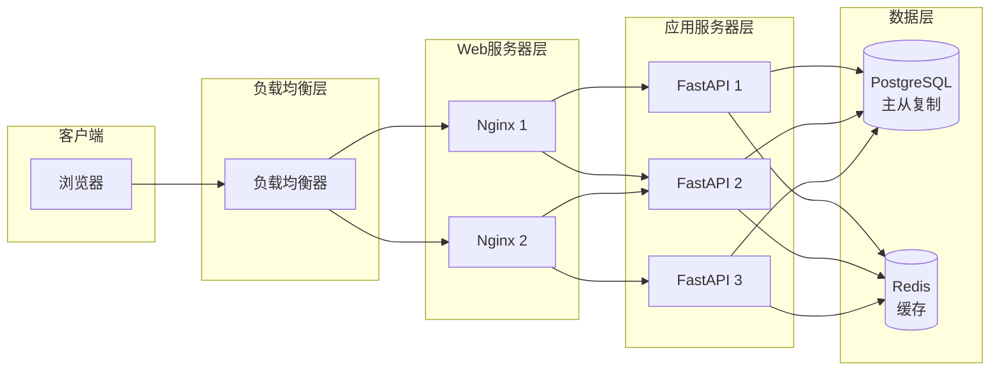

---

### 数据流向图

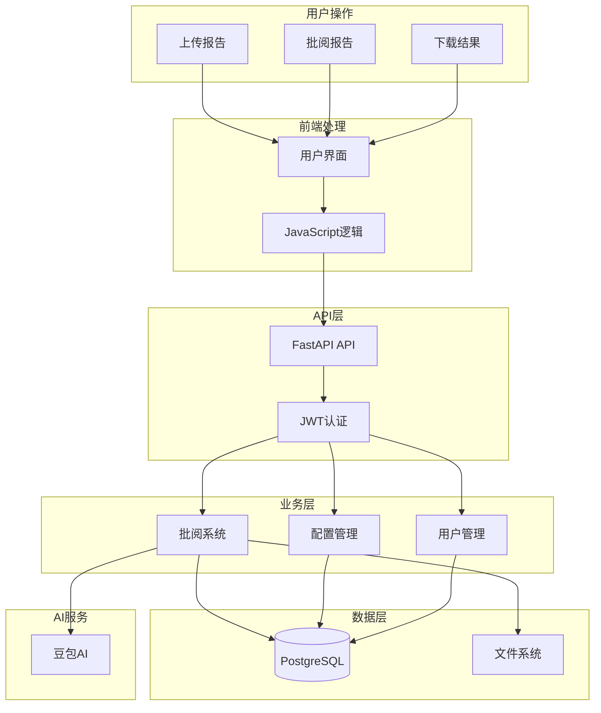

---

## 附录

### 环境变量配置

| 变量名 | 说明 | 默认值 |
|--------|------|--------|
| AI_API_KEY | AI服务API密钥 | - |
| ARK_API_KEY | 豆包API密钥 | - |
| DATABASE_URL | 数据库连接URL | postgresql://... |
| SECRET_KEY | JWT密钥 | your_secret_key_here |
| PORT | 服务端口 | 8000 |
| LOG_LEVEL | 日志级别 | INFO |

### 端口说明

| 端口 | 服务 | 说明 |
|------|------|------|
| 8000 | FastAPI | 后端API服务 |
| 5432 | PostgreSQL | 数据库服务 |

### 目录结构

```
ai_report/
├── api_server.py              # API服务器
├── user_manager.py            # 用户管理器
├── config_manager.py          # 配置管理器
├── log_manager.py             # 日志管理器
├── grading_system.py          # 批阅系统
├── document_processor.py      # 文档处理器
├── ai_grader.py               # AI评分器
├── file_manager.py            # 文件管理器
├── database.py                # 数据库连接
├── database/
│   └── init.sql              # 数据库初始化脚本
├── front/                     # 前端文件
│   ├── index.html
│   ├── login.html
│   ├── admin_dashboard.html
│   ├── admin_users.html
│   ├── admin_logs.html
│   ├── style.css
│   ├── login.css
│   ├── admin.css
│   ├── script.js
│   ├── login.js
│   ├── admin_dashboard.js
│   ├── admin_users.js
│   └── admin_logs.js
├── student_reports/           # 学生报告存储
├── graded_reports/            # 已批阅报告存储
├── output_data/               # 输出数据
├── logs/                      # 日志文件
├── docker-compose.yml         # Docker编排文件
├── Dockerfile                 # Docker镜像构建文件
├── requirements.txt           # Python依赖
├── .env                       # 环境变量配置
└── README.md                  # 项目说明
```

---

## 版本历史

| 版本 | 日期 | 说明 |
|------|------|------|
| 1.0.0 | 2024-01-05 | 初始版本，包含完整功能 |

---

## 联系方式

如有问题或建议，请联系开发团队。
