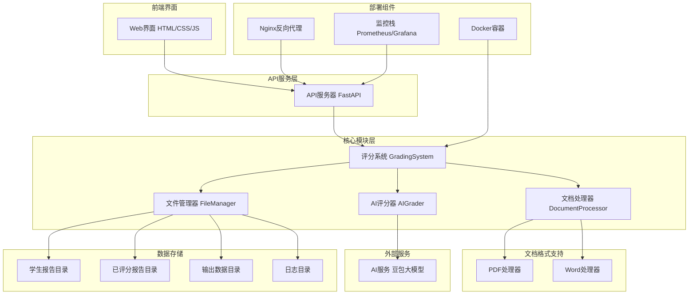
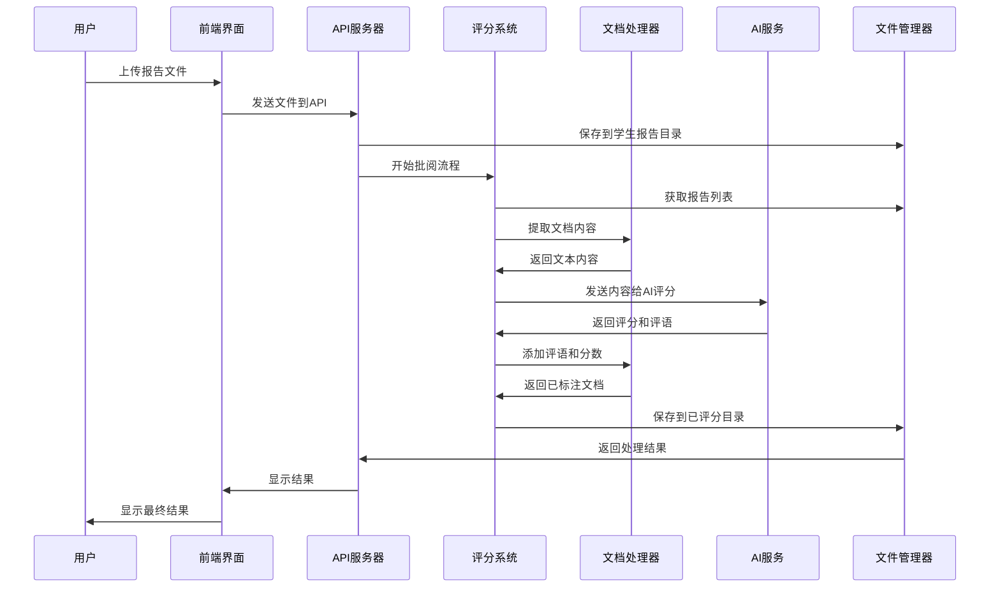

# AI实验报告自动批阅系统架构图

```mermaid
graph TB
    subgraph "前端界面"
        A[Web界面 HTML/CSS/JS]
    end
    
    subgraph "API服务层"
        B[API服务器 FastAPI]
    end
    
    subgraph "核心模块层"
        C[评分系统 GradingSystem]
        D[AI评分器 AIGrader]
        E[文档处理器 DocumentProcessor]
        F[文件管理器 FileManager]
    end
    
    subgraph "文档格式支持"
        E1[PDF处理器]
        E2[Word处理器]
    end
    
    subgraph "外部服务"
        G[AI服务 豆包大模型]
    end
    
    subgraph "数据存储"
        H[学生报告目录]
        I[已评分报告目录]
        J[输出数据目录]
        K[日志目录]
    end
    
    subgraph "部署组件"
        L[Docker容器]
        M[Nginx反向代理]
        N[监控栈 Prometheus/Grafana]
    end
    
    A --> B
    B --> C
    C --> D
    C --> E
    C --> F
    D --> G
    E --> E1
    E --> E2
    F --> H
    F --> I
    F --> J
    F --> K
    L --> C
    M --> B
    N --> B
```

## 系统流程图

```mermaid
sequenceDiagram
    participant User as 用户
    participant Frontend as 前端界面
    participant API as API服务器
    participant GradingSystem as 评分系统
    participant DocProcessor as 文档处理器
    participant AI as AI服务
    participant FileManager as 文件管理器
    
    User->>Frontend: 上传报告文件
    Frontend->>API: 发送文件到API
    API->>FileManager: 保存到学生报告目录
    API->>GradingSystem: 开始批阅流程
    GradingSystem->>FileManager: 获取报告列表
    GradingSystem->>DocProcessor: 提取文档内容
    DocProcessor->>GradingSystem: 返回文本内容
    GradingSystem->>AI: 发送内容给AI评分
    AI->>GradingSystem: 返回评分和评语
    GradingSystem->>DocProcessor: 添加评语和分数
    DocProcessor->>GradingSystem: 返回已标注文档
    GradingSystem->>FileManager: 保存到已评分目录
    FileManager->>API: 返回处理结果
    API->>Frontend: 显示结果
    Frontend->>User: 显示最终结果
```