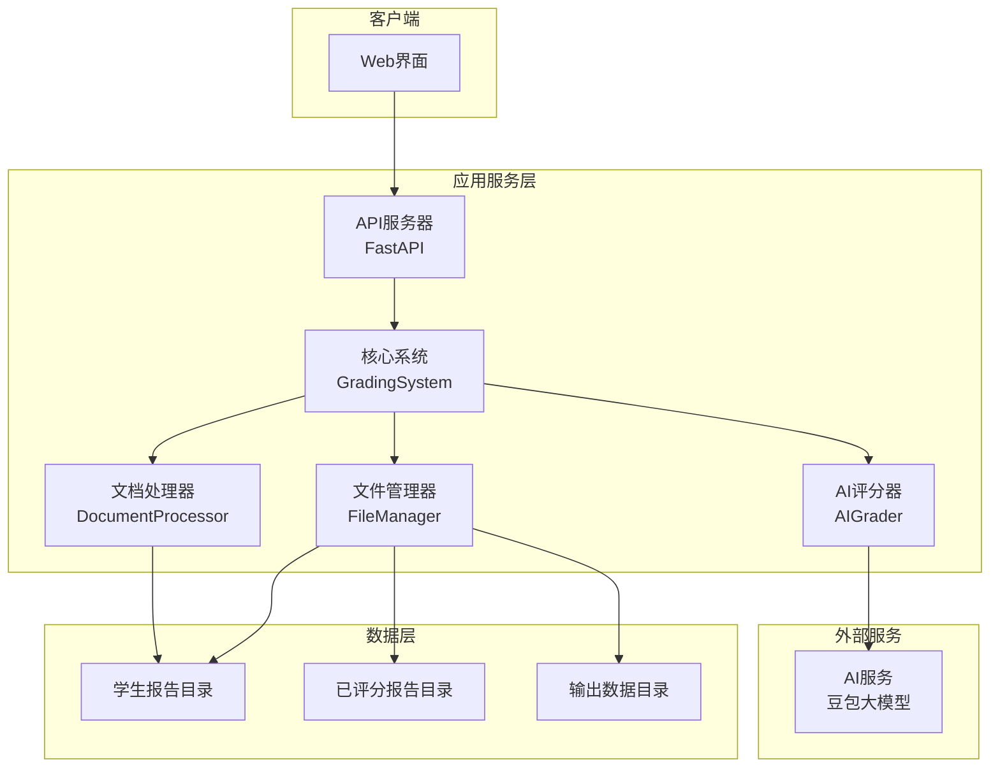
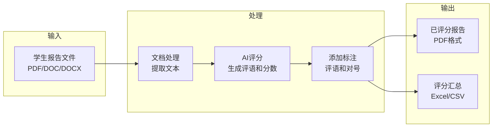
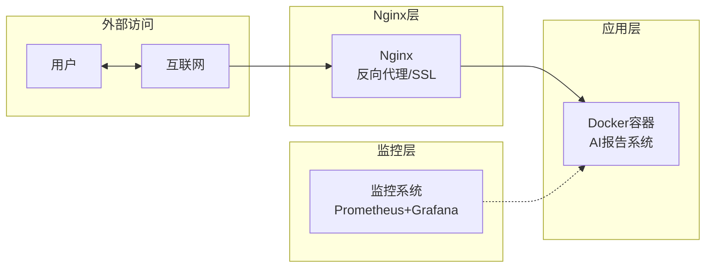

# AI实验报告自动批阅系统 - 简化架构图

## 系统架构

## 数据流向

## 部署架构

## 模块关系

- **GradingSystem**: 核心协调器，管理整个评分流程
- **DocumentProcessor**: 处理不同格式文档（PDF/Word）
- **AIGrader**: 与AI服务交互，获取评分和评语
- **FileManager**: 管理文件存储和检索
- **API Server**: 提供REST API接口
- **Frontend**: 提供Web用户界面

该系统采用模块化设计，各组件职责清晰，易于维护和扩展。